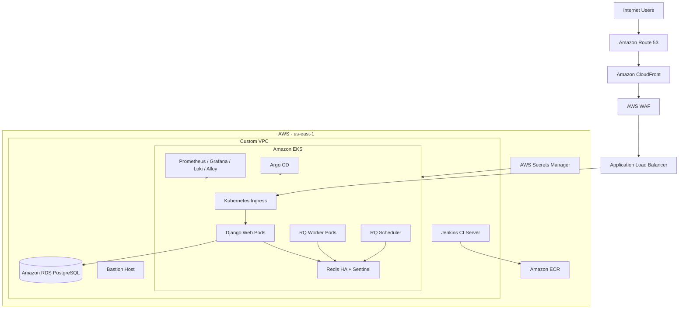
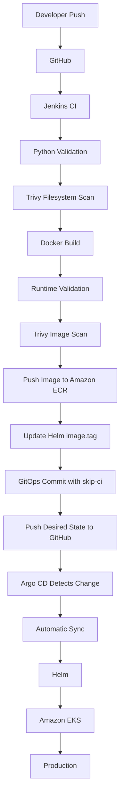

# Production Status Page Platform

<p align="center">
  <strong>Production-grade DevOps platform on AWS EKS with Infrastructure as Code, high availability, observability, security controls, and a fully automated GitOps delivery workflow.</strong>
</p>

<p align="center">
  
  
  
  
  
  
  
  
</p>

## Overview

This repository contains the infrastructure, deployment, CI/CD, GitOps, high-availability, security, and observability implementation for a production Status Page application.

The project is intentionally designed as a production-style DevOps platform rather than a simple application deployment. The application runs on **Amazon EKS**, infrastructure is managed with **Terraform**, hosts are automated with **Ansible**, Kubernetes resources are packaged with **Helm**, CI runs in **Jenkins**, and continuous delivery is handled through **Argo CD GitOps**.

**Production URL:** https://app.avivneta-statuspage.com

### Project Team

- **Aviv Hamoy**
- **Neta Weizenberg**

---

## High-Level Architecture



---

## AWS Infrastructure

The AWS environment is managed through Terraform and uses segmented public/private networking.

### Core Services

- Custom VPC
- Public and private subnets
- Internet Gateway
- NAT Gateway
- Route tables
- Security Groups
- Bastion host
- Private Jenkins server
- Amazon EKS
- Amazon ECR
- Amazon RDS PostgreSQL
- AWS Secrets Manager
- AWS Load Balancer Controller
- Amazon EBS CSI Driver
- Amazon Route 53
- AWS Certificate Manager
- Amazon CloudFront
- AWS WAF

The EKS worker nodes and database run in private network segments. Administrative access to internal infrastructure is performed through controlled paths such as the Bastion host rather than exposing internal systems directly to the internet.

---

## Amazon EKS

The production platform runs on an Amazon EKS cluster with three private worker nodes.

The cluster hosts:

- Django application replicas
- RQ workers
- RQ scheduler
- Redis HA with Sentinel
- Prometheus
- Grafana
- Alertmanager
- Loki
- Grafana Alloy
- Argo CD

The application is deployed from the `status-page-chart` Helm chart.

### Main Production Workloads

| Workload | Purpose |
|---|---|
| `status-page` | Django web application |
| `rq-worker` | Background task processing |
| `rq-scheduler` | Scheduled background jobs |
| `redis-ha-node` | Redis replication and Sentinel |
| `Ingress` | Application routing through ALB |
| `ServiceMonitor` | Prometheus application discovery |

---

## PostgreSQL on Amazon RDS

Production persistence is provided by Amazon RDS for PostgreSQL.

The Terraform configuration includes:

- Private database subnet group
- `publicly_accessible = false`
- Encrypted storage
- `gp3` storage
- Automated backups
- 7-day backup retention
- Maintenance window
- Automatic minor version upgrades
- Deletion protection
- Dedicated RDS security group

The database is kept outside Kubernetes so application compute and database lifecycle are separated.

---

## Secrets Management

Database connection information is stored in AWS Secrets Manager rather than committed to Git.

The managed database secret contains the connection values required by the application, including:

- PostgreSQL host
- Port
- Database name
- Username
- Password

Additional runtime credentials are delivered through Kubernetes and Jenkins secret stores where appropriate.

---

## Redis High Availability

Redis was upgraded from a single-instance dependency to a replicated, Sentinel-managed deployment.

### Redis Design

```text
Redis HA
├── Redis node
├── Redis node
├── Redis node
└── Sentinel coordination
    ├── Primary discovery
    ├── Failure detection
    └── Failover coordination
```

### Configuration

- Replication architecture
- Three Redis pods in production
- Redis Sentinel enabled
- Sentinel master set: `status-page-master`
- Sentinel quorum: `2`
- Redis authentication enabled
- Persistent EBS-backed storage
- `gp3` storage class
- Pod anti-affinity across Kubernetes hosts

The application uses Sentinel-based discovery rather than depending on a fixed Redis primary pod.

---

## CI/CD and GitOps

The delivery architecture deliberately separates Continuous Integration from Continuous Delivery.

### Responsibility Model

**Jenkins = CI**

Jenkins is responsible for:

- Source checkout
- Python source validation
- Trivy filesystem vulnerability scanning
- Docker image build
- Runtime validation
- Trivy container image scanning
- Amazon ECR image push
- Updating the desired image version in Git

**Argo CD = CD**

Argo CD is responsible for:

- Watching the Git repository
- Comparing Git desired state with the cluster
- Detecting drift
- Automatically synchronizing approved Git state
- Applying the Helm-managed application state to Amazon EKS

**Git = Source of Truth**

Jenkins no longer performs direct production deployment commands. Production state is defined in Git and reconciled by Argo CD.

---

## End-to-End Delivery Flow



---

## Jenkins Pipeline

The Jenkinsfile contains the complete CI and GitOps update workflow.

### Pipeline Stages

```text
Checkout
   ↓
Detect GitOps Commit
   ↓
Python Validation
   ↓
Trivy Filesystem Scan
   ↓
Docker Build
   ↓
Runtime Validation
   ↓
Trivy Image Scan
   ↓
Push to Amazon ECR
   ↓
Update GitOps Desired State
```

### Runtime Validation

A successful Docker build is not enough for promotion.

Jenkins creates an isolated temporary Docker environment containing:

- PostgreSQL
- Redis
- The newly built application image
- A dedicated Docker network

The stage then:

1. Waits for PostgreSQL readiness.
2. Waits for Redis readiness.
3. Runs Django database migrations.
4. Starts the application container.
5. Performs an HTTP runtime health check.
6. Removes all temporary CI resources.

If runtime validation fails, the pipeline stops before GitOps desired state is updated.

### Trivy Security Gates

Trivy is integrated in two places:

- Filesystem dependency scan before image promotion
- Container image scan after the Docker build

Both scans are configured to block the pipeline on the configured CRITICAL vulnerability policy.

---

## Amazon ECR

Successful application images are published to a private Amazon ECR repository.

Each Jenkins build uses the Jenkins build number as the versioned image tag and also updates `latest`.

GitOps deployment state references an explicit build tag, so production does not depend only on a mutable `latest` tag.

---

## GitOps Desired State Update

After all CI gates pass, Jenkins changes only the top-level Helm image tag in:

```text
status-page-chart/values.yaml
```

Jenkins creates a commit in the following form:

```text
chore(gitops): deploy image <BUILD_NUMBER> [skip ci]
```

The `[skip ci]` marker is detected by the Jenkinsfile so Jenkins-generated GitOps commits do not recursively trigger another full build.

### Git Push Safety

Before Jenkins pushes desired state, it:

1. Fetches `origin/main`.
2. Compares the current checked-out revision with the remote branch.
3. Refuses to overwrite the remote if `main` changed while the build was running.
4. Stages only `status-page-chart/values.yaml`.
5. Pushes through a dedicated SSH credential.

This prevents a running build from blindly overwriting newer repository changes.

### GitHub Authentication

Jenkins uses a dedicated GitHub SSH deploy key stored in Jenkins Credentials for GitOps writes. The private key is not committed to the repository.

---

## Argo CD

Argo CD provides the continuous delivery layer.

The application tracks:

```text
Repository: SetGaming/status-page-project
Branch:     main
Path:       status-page-chart
Release:    status-page
Namespace:  status-page
```

### Automated Sync Policy

```yaml
syncPolicy:
  automated:
    prune: false
    selfHeal: true
```

`selfHeal: true` allows Argo CD to reconcile managed Kubernetes resources back toward the Git-defined state when drift occurs.

`prune: false` is intentionally retained as a safety boundary so automatic synchronization does not automatically delete resources that disappear from Git.

---

## Verified Automated GitOps Deployment

The complete automated workflow was validated in production with Jenkins Build #14.

The verification sequence was:

1. A normal Git commit triggered the Jenkins pipeline.
2. Jenkins completed validation, scans, build, runtime testing, and ECR push.
3. Jenkins changed the Helm image from build `13` to build `14`.
4. Jenkins pushed the GitOps commit to `main`.
5. Argo CD detected the new Git revision.
6. No manual `argocd app sync` command was used.
7. Argo CD automatically synchronized the application.
8. `status-page`, `rq-worker`, and `rq-scheduler` rolled to image `14`.
9. Argo CD reached `Synced / Healthy`.
10. The production endpoint returned HTTP `200`.

This proved the full path:

```text
GitHub
→ Jenkins CI
→ Amazon ECR
→ Git desired state
→ Argo CD Auto Sync
→ Helm
→ Amazon EKS
→ Production
```

---

## Monitoring and Observability

The cluster includes a dedicated observability stack.

### Metrics

- Prometheus
- Kubernetes metrics
- Application metrics
- ServiceMonitor discovery

### Dashboards

- Grafana
- Custom Status Page dashboard
- Kubernetes infrastructure visibility

### Alerting

- Alertmanager
- Project-specific alert rules

### Logging

- Loki
- Grafana Alloy
- Kubernetes log collection
- Loki datasource in Grafana

Monitoring configuration is stored under:

```text
monitoring/
```

---

## Security Architecture

Security controls are implemented across multiple layers.

### Network

- Private EKS worker nodes
- Private RDS database
- Bastion-based administration
- Security Group segmentation
- NAT-based outbound access for private workloads

### Edge and TLS

- Route 53
- CloudFront
- AWS WAF
- Application Load Balancer
- AWS Certificate Manager
- HTTPS production endpoint

### Secrets

- AWS Secrets Manager
- Kubernetes Secrets
- Jenkins Credentials
- Dedicated GitHub SSH deploy key

### CI Security

- Trivy filesystem scan
- Trivy image scan
- Runtime validation before promotion
- Explicit Git staging
- Remote revision safety check

### Kubernetes

- Namespace separation
- EBS-backed persistent storage
- Redis pod anti-affinity
- Health-aware rollouts
- Argo CD reconciliation

---

## Public Request Flow

```text
Client
  ↓
Route 53
  ↓
CloudFront
  ↓
AWS WAF
  ↓
Application Load Balancer
  ↓
Kubernetes Ingress
  ↓
Status Page Service
  ↓
Django Pods
```

---

## Observability Flow

```text
Application / Kubernetes / Nodes
              ↓
          Prometheus
              ↓
           Grafana

Kubernetes Logs
      ↓
Grafana Alloy
      ↓
     Loki
      ↓
   Grafana

Prometheus Alerts
       ↓
  Alertmanager
```

---

## Infrastructure as Code

Terraform manages the AWS platform.

Representative files include:

```text
terraform/
├── backend.tf
├── networking.tf
├── nat.tf
├── compute.tf
├── eks.tf
├── eks_launch_template.tf
├── ecr.tf
├── rds.tf
├── secrets.tf
├── iam.tf
├── ebs_csi.tf
├── aws_load_balancer_controller.tf
├── domain.tf
├── cloudfront_waf.tf
└── outputs*.tf
```

Infrastructure changes are managed through code and reviewed state rather than depending on manual console-only configuration.

---

## Configuration Management

The repository contains Ansible automation under:

```text
ansible/
```

Ansible complements Terraform for host-level configuration and automation.

---

## Helm

The production application chart is located at:

```text
status-page-chart/
```

The chart manages application-level Kubernetes resources including deployments, services, ingress, application configuration, and monitoring integration.

The image tag in Helm values is the GitOps deployment source of truth.

---

## Repository Structure

```text
status-page-project/
├── ansible/                  # Configuration management
├── argocd/                   # Argo CD configuration
├── docs/                     # Project documentation
├── monitoring/               # Metrics, dashboards, alerts and logging
├── redis-ha/                 # Redis replication / Sentinel values
├── scripts/                  # Operational helper scripts
├── status-page-chart/        # Production Helm chart
├── statuspage/               # Django application
├── terraform/                # AWS Infrastructure as Code
├── Dockerfile                # Application container image
├── Jenkinsfile               # CI and GitOps pipeline
├── requirements.txt
└── README.md
```

---

## Failure Safety

| Failure | Result |
|---|---|
| Python validation fails | Pipeline stops |
| Trivy filesystem scan fails | Pipeline stops |
| Docker build fails | No image promotion |
| Runtime validation fails | No GitOps desired-state update |
| Trivy image scan fails | No GitOps desired-state update |
| ECR push fails | Git desired state remains unchanged |
| Remote `main` changes during the build | Jenkins refuses unsafe push |
| Git and cluster differ | Argo CD reports and reconciles drift |
| Rollout is unhealthy | Argo CD health reflects the degraded deployment |

---

## Rollback Strategy

Because Git is the deployment source of truth, a rollback is performed by restoring a previously known-good desired state.

```text
Git revert / restore known-good image tag
              ↓
            GitHub
              ↓
           Argo CD
              ↓
        Automatic Sync
              ↓
             EKS
```

Versioned images in ECR allow a previously validated build to be selected again.

---

## Operational Verification

Useful checks from the administrative environment include:

```bash
kubectl get application status-page -n argocd
```

```bash
kubectl get deployment status-page rq-worker rq-scheduler -n status-page
```

```bash
kubectl get pods -n status-page -o wide
```

```bash
curl -I https://app.avivneta-statuspage.com
```

A healthy deployment should report:

```text
Argo CD: Synced / Healthy
Application workloads: Ready
Redis HA: Running
Production endpoint: HTTP 200
```

---

## Technology Stack

| Area | Technologies |
|---|---|
| Cloud | AWS |
| Infrastructure as Code | Terraform |
| Configuration Management | Ansible |
| Containers | Docker |
| Orchestration | Kubernetes / Amazon EKS |
| Packaging | Helm |
| CI | Jenkins |
| CD / GitOps | Argo CD |
| Registry | Amazon ECR |
| Database | Amazon RDS PostgreSQL |
| Cache / Queue | Redis HA + Sentinel |
| Background Jobs | RQ / RQ Scheduler |
| Metrics | Prometheus |
| Dashboards | Grafana |
| Logging | Loki / Grafana Alloy |
| Alerting | Alertmanager |
| Security Scanning | Trivy |
| Edge / Security | CloudFront / AWS WAF |
| TLS | AWS Certificate Manager |
| DNS | Route 53 |
| Application | Python / Django |

---

## Team Responsibilities

### Aviv Hamoy

Primary responsibility for the production DevOps platform, including:

- Terraform infrastructure
- AWS networking
- Public/private subnet architecture
- NAT and Bastion access
- Amazon EKS
- Amazon ECR
- Amazon RDS
- AWS Secrets Manager
- Jenkins infrastructure and CI pipeline
- Runtime Validation
- Trivy integration
- Jenkins-to-Git GitOps workflow
- Argo CD implementation
- Redis HA and Sentinel
- AWS Load Balancer Controller
- EBS CSI
- CloudFront
- AWS WAF
- Route 53
- ACM
- Prometheus
- Grafana
- Loki
- Grafana Alloy
- Alertmanager
- Security hardening
- Production integration and validation

### Neta Weizenberg

Primary responsibility for application-side implementation and containerization, including:

- Django application work and integration
- Application Dockerfile
- Application-level configuration

### Shared Work

Shared areas included Kubernetes application resources, Helm integration, application deployment decisions, RQ integration, documentation, testing, and project delivery.

---

## Key Engineering Decisions

### Jenkins does not deploy directly to EKS

Jenkins performs CI and updates Git desired state. Argo CD performs deployment. This keeps the CI server from becoming the production source of truth.

### Git is authoritative

The cluster converges toward the configuration stored in Git.

### Redis uses HA rather than a single pod

Redis is part of the application runtime and background-job path, so a single instance would create an unnecessary single point of failure.

### PostgreSQL runs outside the cluster

Production PostgreSQL is provided by Amazon RDS rather than being treated as an ordinary Kubernetes workload.

### Automatic pruning remains disabled

GitOps automation is enabled while destructive automatic resource deletion remains explicitly disabled.

---

## Current Scope

The repository may contain Terraform or configuration files for experiments and future capabilities. The presence of code alone does not mean a capability is considered production-verified.

This README documents the architecture and workflows that were implemented and validated as part of the project.

---

## Application Origin and Acknowledgements

The Status Page application layer is based on the open-source **Status-Page** project.

The focus of this repository is the DevOps implementation around the application: AWS architecture, infrastructure automation, Kubernetes, CI/CD, GitOps, high availability, security, and observability.

Original upstream project: https://github.com/Status-Page/Status-Page

Please refer to `LICENSE.txt` and the upstream project notices for applicable licensing and attribution.

---

## Final Verified Delivery State

The production delivery path has been validated end-to-end:

```text
Jenkins CI             ✅
Runtime Validation     ✅
Trivy Security Scans   ✅
Amazon ECR             ✅
GitOps Commit          ✅
Argo CD Auto Sync      ✅
Amazon EKS             ✅
Redis HA               ✅
Argo Synced            ✅
Argo Healthy           ✅
Production HTTP 200    ✅
```
